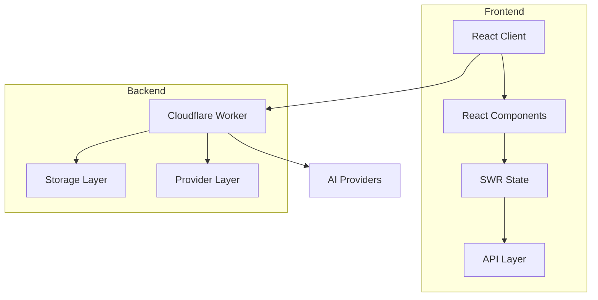

# y-gui 🚀

A web-based graphical interface for AI chat interactions with support for multiple AI models.

Check out [y-cli](https://github.com/luohy15/y-cli) for a CLI version.

## Demo


### MCP in Action
See how y-gui uses MCP servers to extend AI capabilities:

- [Image Generation](https://yovy.app/share/0e36ad05) - Generate images directly within your chat conversation

## ✨ Features

- 💬 Interactive chat interface with AI models
- 🤖 Support for multiple bot configurations (any base_url/api_key/model combination)
- 🔗 Support for MCP (Model Context Protocol) servers with:
  - 🖼️ Image generation capabilities
  - 🧩 Expandable framework for additional MCP servers and tools
- 🌓 Dark/light theme support
- 📝 Chat data stored in memory (cleared on refresh)
- 💾 Bot and MCP server configs saved in browser localStorage
- 🔄 Real-time updates with SWR
- 📱 Responsive design for all devices

## Architecture

y-gui consists of two main components:

1. **Frontend**: React application with TypeScript, Tailwind CSS, and SWR for data fetching
2. **Backend**: Cloudflare Workers with in-memory storage



## ⚡ Quick Start

### Prerequisites

1. Node.js and npm
2. Cloudflare account
3. API keys for AI providers

### Installation

1. Clone the repository:
   ```bash
   git clone https://github.com/luohy15/y-gui.git
   cd y-gui
   ```

2. Install dependencies:
   ```bash
   npm install
   ```

3. Configure environment variables:
   - Copy `backend/.dev.vars.example` to `backend/.dev.vars` and fill in the values.
     `OPENROUTER_BASE_URL` specifies the default OpenRouter API endpoint and
    `OPENROUTER_FREE_KEY` provides a fallback API key. `API_TIMEOUT_MS` sets the
    default timeout (in milliseconds) for provider requests (defaults to
    `300000`, i.e. 5 minutes). These values are
     used whenever a bot configuration does not include its own `base_url`,
     `api_key`, or `timeout_ms`.
   - Configure Cloudflare Worker settings in `backend/wrangler.toml`

4. Build asset:
   ```bash
   npm run build
   ```

5. Deploy cloudflare worker
   ```bash
   npm run deploy
   ```

## 🛠️ Development

### Project Structure

```
y-gui/
├── frontend/               # React frontend application
│   ├── src/
│   │   ├── components/     # React components
│   │   ├── contexts/       # React contexts
│   │   ├── utils/          # Utility functions
│   │   └── index.tsx       # Entry point
├── backend/                # Cloudflare Worker backend
│   ├── src/
│   │   ├── api/            # API endpoints
│   │   ├── middleware/     # Middleware
│   │   ├── repository/     # Data access
│   │   └── index.ts        # Worker entry
├── shared/                 # Shared code between frontend and backend
│   └── types/              # TypeScript type definitions
└── memory-bank/            # Project documentation
```

### Available Scripts

- `npm run dev`: Start both frontend and backend development servers
- `npm run dev:frontend`: Start only the frontend development server
- `npm run dev:backend`: Build the frontend and then start the backend development server
- `npm run build`: Build both frontend and backend
- `npm run deploy`: Deploy the backend to Cloudflare Workers
- `npm run test`: Run tests

Before running the development server, copy `backend/.dev.vars.example` to `backend/.dev.vars` and set your environment variables. `OPENROUTER_BASE_URL` and `OPENROUTER_FREE_KEY` act as fallback credentials when a bot configuration omits `base_url` or `api_key`. `API_TIMEOUT_MS` defines the default request timeout (5 minutes by default) used when `timeout_ms` is not specified in a bot configuration.


When starting with `npm run dev`, the browser will open to `/`. This page automatically
creates a new chat via the backend and redirects to `/chat/<id>`. If the backend
is still starting you may briefly see a "Connecting to server…" message. Wait a
moment and the chat window will load once the worker is ready.

## 🤖 Bot Configuration

y-gui supports multiple bot configurations with the following properties:

- Name
- Model
- Base URL
- API Key
- Print Speed
- MCP Servers
- API Type
- Custom API Path
- Max Tokens
- Reasoning Effort
- Timeout (ms)

## 🔗 MCP Server Configuration

MCP (Model Context Protocol) servers can be configured with simple:
- **Name**: Unique identifier for the MCP server
- **URL**: For remotely hosted MCP services
 - **Token**: API token for server access

Current MCP servers can include image generation and custom services to connect with virtually any API or service.

## 🌐 API Endpoints

The backend provides RESTful API endpoints for:

- Chat operations
- Bot configuration management
- MCP server configuration management

## 🔄 Data Storage

- Chat data is stored in memory (not persisted)
- Bot and MCP server configurations are stored in browser localStorage
- MCP server data is securely managed through authorized API connections

## 🧩 Technologies Used

- **Frontend**: React, TypeScript, Tailwind CSS, SWR
- **Backend**: Cloudflare Workers with in-memory storage
- **Integrations**: MCP servers and image generation APIs
- **Build Tools**: Vite, Wrangler, TypeScript

## 📚 Documentation

For more detailed documentation, see the [memory-bank](./memory-bank) directory.

Visit the [deepwiki page](https://deepwiki.com/luohy15/y-gui) for comprehensive project documentation and guides.

## 🤝 Contributing

Contributions are welcome! Please feel free to submit a Pull Request.

## 📄 License

This project is licensed under the MIT License - see the LICENSE file for details.
