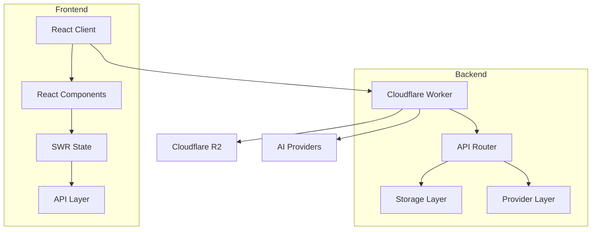
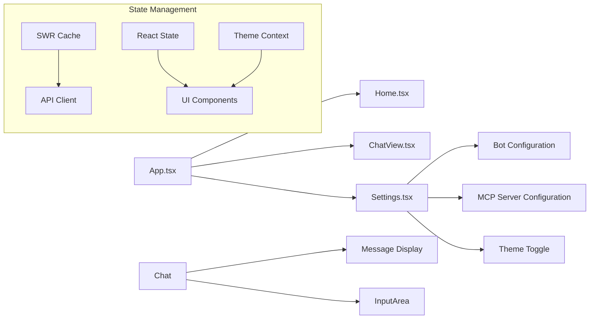

# System Patterns: y-gui

## Architecture Overview

### Core Components


## Design Patterns

### Repository Pattern
- Implemented in ChatRepository
- Handles data operations with Cloudflare R2
- Provides consistent interface for data access
- Manages chat data persistence and retrieval

### Component Pattern
- React functional components with hooks
- Modular UI structure
- Reusable component library
- Clear component hierarchy

### State Management
- SWR for data fetching and caching
- React hooks for local state
- Optimistic updates for better UX
- Consistent state synchronization


### Access Pattern
Open access without authentication. No login or token management is required.

## Component Relationships

### Frontend Architecture


### Backend Architecture
```mermaid
flowchart LR
    Worker[Worker] --> Router[API Router]
    Router --> Storage[Storage Layer]
    Router --> Provider[Provider Layer]
    Router --> Config[Configuration Layer]

    subgraph "Storage"
        Storage --> R2[R2 Operations]
    end

    subgraph "Configuration"
        Config --> BotConfig[Bot Configurations]
        Config --> McpConfig[MCP Server Configurations]
    end
```

## Key Technical Decisions

### Frontend Structure
- React with TypeScript
- Tailwind CSS for styling
- SWR for data management
- Component-based architecture
- Context API for theme management
- Configuration-driven bot and MCP server management

### Backend Structure
- Cloudflare Workers
- R2 for storage
- Middleware pattern for request handling
- RESTful API design

### Data Flow
- Unidirectional data flow
- Optimistic updates
- Real-time synchronization
- Error boundary handling


### Access Flow
Users open the web interface and immediately begin chatting without login.

## Error Handling
- Global error boundaries
- API error handling
- Loading states
- User feedback
- Retry mechanisms

## Extension Points
- Additional UI components
- New API endpoints
- Storage optimizations
- Provider integrations

## Testing Strategy
- Component unit tests
- Integration tests
- API endpoint tests
- Storage layer tests

## Performance Patterns
- SWR caching
- Optimistic updates
- Lazy loading
- Asset optimization
- Edge deployment

## Security Patterns
- API request validation
- Data sanitization
- Error message security
